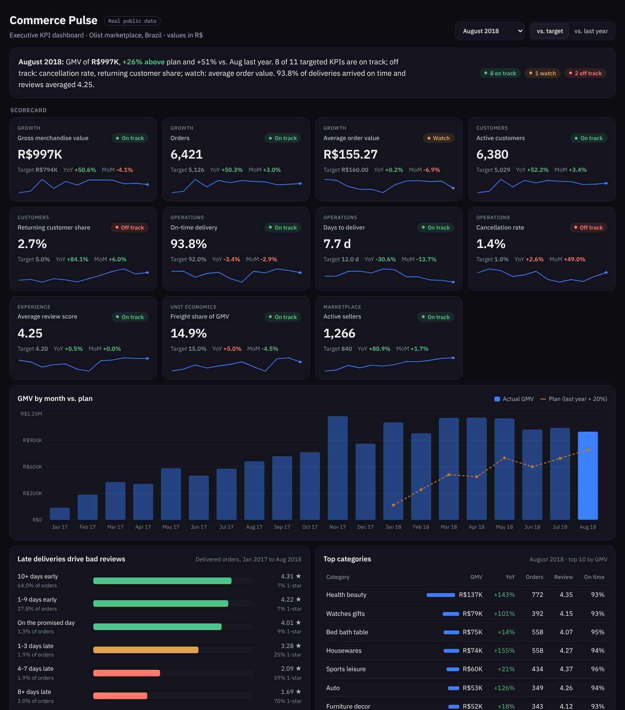
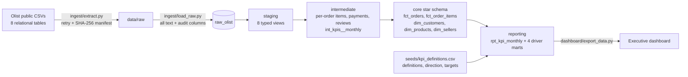

# Commerce Pulse: Executive KPI Dashboard

An executive KPI dashboard for an e-commerce marketplace, built on about 100,000 **real orders** from the Olist Brazilian E-Commerce Public Dataset. Each KPI is defined once in a governed catalog, computed once in dbt, and checked against a target. The dashboard opens with a written brief: what happened this month, which KPIs are on or off track, and why.



## What an exec gets

- **A one-paragraph brief**, generated from the data: GMV vs. plan and last year, KPIs on track / watch / off track, delivery and review health.
- **An 11-KPI scorecard** across growth, customers, operations, experience, unit economics and marketplace. Each tile shows the value, status, target, year-over-year and month-over-month change, plus a 12-month sparkline. It can switch between "vs. target" and "vs. last year."
- **GMV vs. plan** by month (click a bar to change the reporting month).
- **Drivers**:
  - Late deliveries vs. review scores (the clearest lever in the data)
  - Category and state leaderboards
  - A cohort retention grid that shows growth is almost entirely new customers
- **KPI definitions and data notes**, so nobody has to ask how a number was calculated.

## Findings the data supports

- GMV in Aug 2018 was R$997K, **+51% year over year**.
- Orders delivered 8+ days late average **1.69 stars**, against 4.31 for orders that arrive early, and **70% of them get 1 star**.
- Only **3.0%** of 96,096 customers ever ordered twice. Under 1% of any monthly cohort returns in a given month.

## Architecture



**The KPI catalog** (`seeds/kpi_definitions.csv`) is the governance layer. Each KPI has one definition, unit, direction (whether up or down is good), target type (absolute, or growth over the same month last year) and target value. `rpt_kpi_monthly` joins to it to set status, so changing a target or adding a KPI is a one-line edit. A test fails the build if any month is missing a KPI.

## Data quality, handled in the pipeline

- **People vs. order IDs.** Olist issues a new `customer_id` on every order. Counting those would make repeat purchasing look like zero, so customers are counted by `customer_unique_id`.
- **Partial months.** The export starts thin in late 2016 and cuts off in early September 2018. The scorecard reports complete months only (Jan 2017 to Aug 2018). Year-over-year targets only look back to complete months, so a 4-order month can't become next year's plan.
- **Duplicate reviews.** 555 orders were reviewed more than once; the latest answer wins.
- **Lost orders.** Canceled and unavailable orders are excluded from GMV but drive the cancellation rate.
- **Untranslated categories.** These keep a readable label instead of dropping out of category totals.
- **In-transit orders.** Orders still in transit at export time have no delivery date, so the latest months' delivery speed looks better than it was. This is noted on the dashboard.

## Tests

`dbt build` runs 63 tests:

- Uniqueness and not-null on every grain
- Relationships from facts to dimensions and from the scorecard to the KPI catalog
- Accepted values for order status, review score and KPI status
- Range checks
- Singular tests:
  - `assert_gmv_reconciles_across_layers`: scorecard GMV = order-level GMV, and item totals = order totals
  - `assert_every_kpi_every_month`
  - `assert_rows_reconcile_to_manifest`: warehouse rows = rows downloaded
  - `assert_payments_match_order_value` (warn): lists orders whose payments don't match their value for review

## Run it

```bash
git clone https://github.com/evannwilsonn/commerce-pulse.git
cd commerce-pulse
python -m venv .venv && source .venv/bin/activate
make setup   # pip install -r requirements.txt
make all     # extract → load → dbt build → export dashboard data
make serve   # http://localhost:8000
```

## Run it on Snowflake

The models use cross-database macros (`macros/cross_db.sql`), so the same project runs on DuckDB or Snowflake. The Snowflake path is written to run as-is but has only been run end to end on DuckDB so far.

```bash
pip install dbt-snowflake
python ingest/extract.py
snowsql -a <account> -u <user> -f ingest/snowflake_load.sql
export SNOWFLAKE_ACCOUNT=<account> SNOWFLAKE_USER=<user> SNOWFLAKE_PASSWORD=<password>
dbt build --target snowflake
```

## Data and license

[Olist Brazilian E-Commerce Public Dataset](https://www.kaggle.com/datasets/olistbr/brazilian-ecommerce): real, anonymized orders from 2016 to 2018, released by Olist under **CC BY-NC-SA 4.0**. This repo downloads it from a public mirror and does not redistribute it. Targets in the KPI catalog are illustrative, since Olist did not publish its own.

Built by Evan Wilson · Python · DuckDB · dbt · Snowflake · SQL · HTML/SVG
